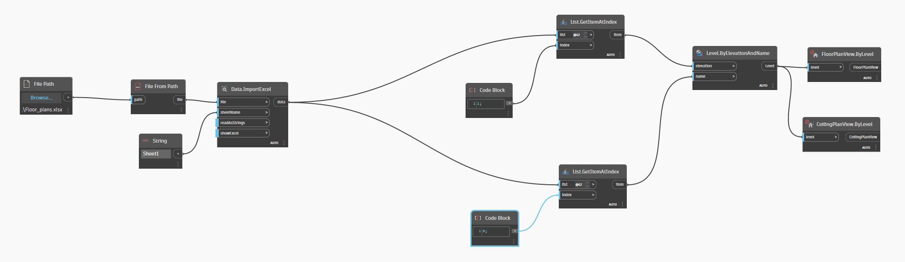
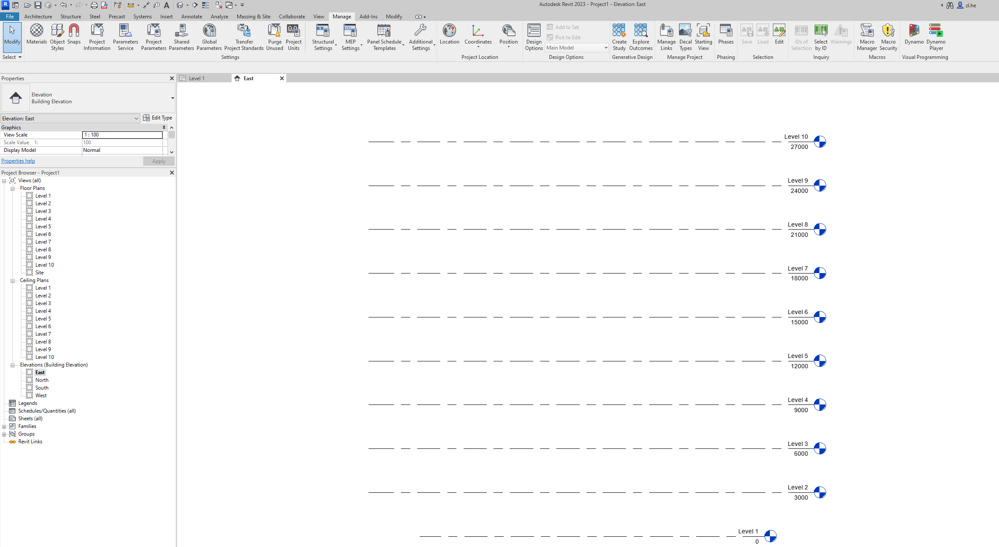
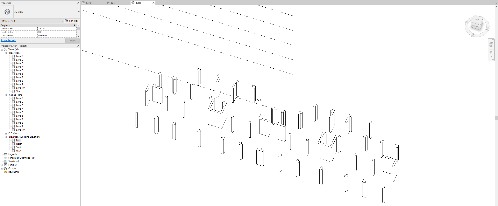

# Intelligent design pipeline integrating BIM and Generative AI
This is a simple tutorial about implementing the pipeline.

## ☝️ Stage 1: From 3D BIM models to 2D architectual drawings

## ✌️ Stage 2: Intelligent structural design using Diffusion Models
You can refer to.

## 👌 Stage 3: From 2D Structural drawings to 3D BIM models
### Step 1. Generate floor plan using Dynamo
- Firstly, we open a new Revit project.  
- Click **Manage**, click **Dynamo**.  
- Open Generate_Floor_plans.dyn, as shown in the following figure:  

  

- **Run** it and we can see the generated floor plans:  

  

### Step 2. Generate shear walls on Level 1 using Dynamo
- Open Shear_walls_From_Excel_to_Revit.dyn.  
- Run it and we can see the shear walls on Level 1, as shown below:  

  

**Note**: (1) Here, we generate the shear walls in test (1)_7degree.png. (2) For the type of shear walls, you can specify it in the Dynamo code.

### Step 3. Draw the beams in Revit
It is worth noting that we need to design beams and draw the beams in Revit to finish the Structural BIM model.
We leave the intelligent and automatic beam designs to future work.  
Here, we don't consider this step for demonstration purposes.

### Step 4. Copy the elements on one floor to another
We can easily accomplish it in Revit.  
- Choose and copy (Ctrl C) the elements on Level 1.
- Click **Paste**. Click **Aligned to Selected Levels**. 

 
