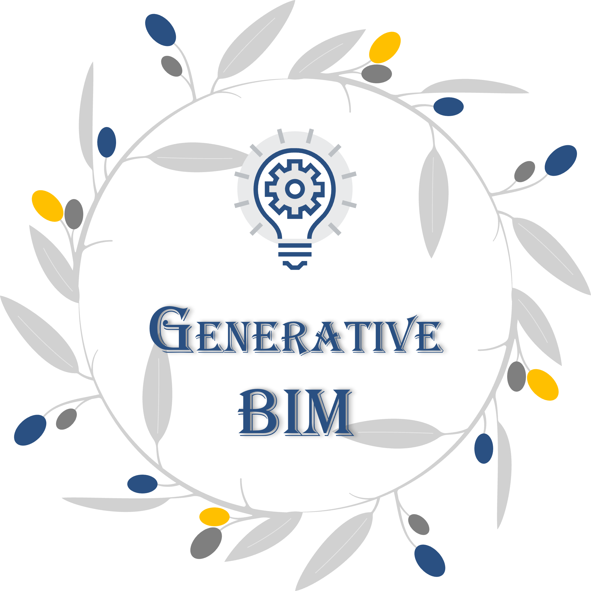

# Generative-BIM
This repository is the official implementation of the **Generative-BIM**.  

# Introduction
This repository mainly includes 3 parts:  
- [x] Modified-dataset.
- [x] Include CrackSeU-B with BN.
- [x] Include CrackSeU-B with LN_Pytorch.
- [x] Include CrackSeU-B with LN_He.

# 🛴 Updates
- **`2023/11/04`**: The preprint of our paper is submitted to [arXiv](https://arxiv.org/).
- **`2022/12/06`**: This repository is built up! It is for the course project of **CIVL 5220 Building Information Modeling and Digital Construction**. Course instructor: [Jack C.P. Cheng](https://www.ce.ust.hk/people/jack-chin-pang-cheng-zhengzhanpeng), Department of Civil and Environmental Engineering, HKUST.

# 💘 Acknowledgements

# 👅 Citing Generative-BIM!
You are very welcome to cite our paper!
