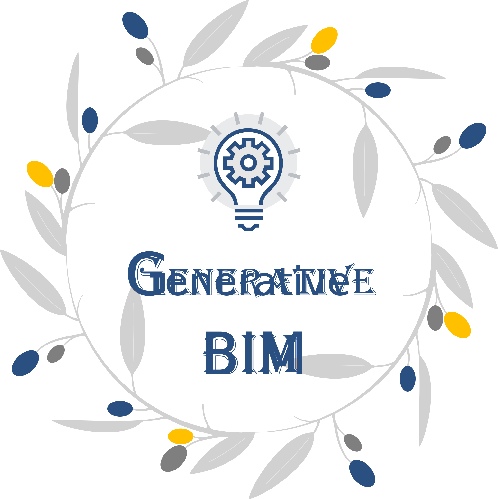

<div align="center">
  
  
</div>

# Generative AIBIM
This repository is the official implementation of the Structural Design Pipeline Integrating **BIM** and **Generative AI** **(Generative AIBIM)**.  
- :orange: **Paper:** [[Journal Version](https://www.sciencedirect.com/science/article/pii/S1566253524004329)] and [[arXiv Version](https://arxiv.org/abs/2311.04052)]. I recommend the [arXiv version](https://arxiv.org/abs/2311.04052) as it offers a better presentation of the equations and figures.
- :watermelon: **Webpage:**  [[Project page](http://zl-he.com/Generative-BIM/)]
- 🍓 **Authors:** [Zhili He](http://zl-he.com/) (HKUST), [Yu-Hsing Wang](https://ce.hkust.edu.hk/people/yu-hsing-wang-wangyouxing) (HKUST), and [Jian Zhang](https://civil.seu.edu.cn/zj/list.htm) (Southeast University)
## ✒️ Introduction
This repository mainly includes 4 parts:  
- [ ] **Generative AIBIM: Structural design pipeline integrating BIM and generative AI**  
      This pipeline contains 4 stages. Stage I and Stage III are converting 3D BIM models to 2D architectural drawings and converting 2D structural drawings to 3D BIM models.  
      We write Python and Dynamo scripts to implement the two stages.  
      The simple **tutorial** and **implementation code** are publicly available at [Structural design pipeline](https://github.com/hzlbbfrog/Generative-BIM/tree/main/Structural%20design%20pipeline).
- [ ] Stage II introduces the the **P**hysics-based **C**onditional **D**iffusion **M**odel **(PCDM)**. The code is openly accessible at [PCDM](https://github.com/hzlbbfrog/Generative-BIM/tree/main/PCDM).
- [ ] **Modified-dataset**.
- [ ] **Evaluation code** including Score_IoU and FID.
- [ ] DDIM sampling for PCDM

## 📅 Updates
- **`2025/07/27`**: We upload the proposed dataset. Link → [Dataset](https://github.com/hzlbbfrog/Generative-BIM/tree/main/Dataset). Because I have to do an urgent project first, I have no sufficient time to manage this project. I will finish this in the future.
- **`2025/03/11`**: Our paper **"Revisit the Generation Framework in Generative AI-Based Intelligent Structural Design"** is accepted by [i3CE 2025](https://www.lsu.edu/eng/cm/i3ce2025/index.php).
- **`2024/09/01`**: Our paper is publicly available. Link → [Journal version](https://www.sciencedirect.com/science/article/pii/S1566253524004329?via%3Dihub).
- **`2024/08/26`**: Our paper is finally accepted by a prestigious journal, [Information Fusion](https://www.sciencedirect.com/journal/information-fusion)!
- **`2024/06/20`**: Our paper **"DDIM sampling for Generative AIBIM, a faster intelligent structural design framework"** is accepted by [IPC 2024](https://ipcannual.com/about/).
- **`2023/11/07`**: The preprint of our paper is available online on arXiv. Link → [Arxiv Paper](https://arxiv.org/abs/2311.04052).
- **`2023/11/04`**: The preprint of our paper is submitted to arXiv.
- **`2022/12/06`**: This repository is built up! It is for the course project of **CIVL 5220 Building Information Modeling and Digital Construction**. Course instructor: [Jack C.P. Cheng](https://www.ce.ust.hk/people/jack-chin-pang-cheng-zhengzhanpeng), Department of Civil and Environmental Engineering, HKUST.

## 🎖️ Experimental results

## Reserch pathway

## 🥰 Cite Generative AIBIM!
If you have any problems, please do not hesitate to contact us!
You are very welcome to cite our paper!  
The BibTeX entries of related papers are as follows:

(1) Generative AIBIM
```BibTeX
@article{Generative_AIBIM,
title = {Generative AIBIM: An automatic and intelligent structural design pipeline integrating BIM and generative AI},
journal = {Information Fusion},
volume = {114},
pages = {102654},
year = {2025},
issn = {1566-2535},
doi = {https://doi.org/10.1016/j.inffus.2024.102654},
url = {https://www.sciencedirect.com/science/article/pii/S1566253524004329},
author = {Zhili He and Yu-Hsing Wang and Jian Zhang},
keywords = {Generative AI, Diffusion model, Building information modeling, Intelligent structural design, Shear wall structure}
}
```

(2) DDIM sampling for Generative AIBIM, a faster intelligent structural design framework  
This [paper](https://arxiv.org/abs/2412.20899) is accepted by [IPC 2024](https://ipcannual.com/proceedings/), Perth, Australia.
```BibTeX
@article{DDIM_Generative_AIBIM,
title = {DDIM sampling for Generative AIBIM, a faster intelligent structural design framework},
author={Zhili He and Yu-Hsing Wang},
year={2024},
eprint={2412.20899},
archivePrefix={arXiv},
primaryClass={cs.CV},
url={https://arxiv.org/abs/2412.20899}
}
```

(3) Revisit the Generation Framework in Generative AI-Based Intelligent Structural Design  
This paper is accepted by [i3CE 2025](https://www.lsu.edu/eng/cm/i3ce2025/index.php), New Orleans, LA, USA.


## 💓 Acknowledgements
This repo benefits from [OpenAI improved-diffusion](https://github.com/openai/improved-diffusion/tree/main), [DDIM](https://github.com/ermongroup/ddim), [DPM-Solver](https://github.com/LuChengTHU/dpm-solver), and last but not least, [StructGAN](https://github.com/wenjie-liao/StructGAN_v1).  
Thanks for their wonderful works!
